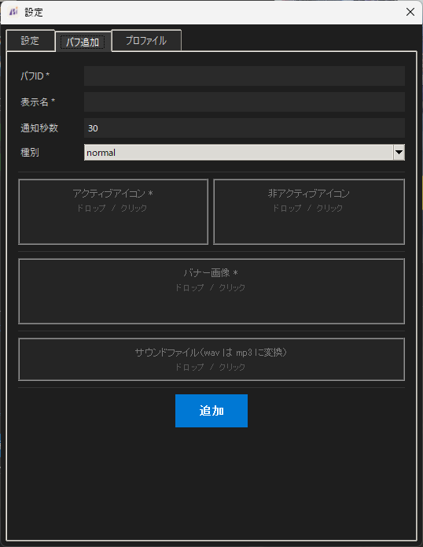

# AdvancedStatList

マビノギ用の常駐ツール

## 機能

### バフ監視・通知

画面を一定間隔でスキャンしてバフの残り時間を読み取り、切れる直前に音声とバナーで知らせる機能

- バフアイコンはテンプレートマッチングで検出
- 残り時間はアイコン右のテキストを読み取り、内部タイマーで管理
- 通知バナーはクリック透過

### スキルCTオーバーレイ

指定したスキルショートカットスロットのアイコンを、画面上の任意の位置にミラー表示する機能

- 位置と拡大率は調整モードでドラッグして任意の位置に設定
- マビノギのウィンドウが非アクティブのときは自動的に非表示になる

### キャラクタープロファイル自動切り替え

- 管理対象はキャラクターごとにプロファイルとして保存
- プレイ中のキャラクターは画面上のスキルショートカット配置で識別し、自動でプロファイルが切り替わる

## 動作環境

- Windows 11
- Python 3.13（ソースから動かす場合）

## 使用方法
### インストール

#### 配布版を使う

[Releases](../../releases)からzipをダウンロードして展開し、`AdvancedStatList.exe`を実行してください。

#### ソースから動かす

```
git clone https://github.com/AdvancedSorceryInstitute/AdvancedStatList.git
cd AdvancedStatList
pip install -r requirements.txt
python src/main.py
```

### 基本設定

設定は`config/`以下にまとまっています。`config/config.yaml`は初回起動時に`config/config.sample.yaml`から生成されます。主な設定項目は次のとおりです。残りは設定ウィンドウから変更できます。

| キー | 意味 |
|---|---|
| `monitor_index` | スキャン対象のモニター（1 = プライマリ） |
| `scan_interval` | スキャン間隔（秒） |
| `warning_threshold` | 通知する残り時間の閾値（秒） |
| `match_threshold` | バフアイコン検出のマッチング閾値 |
| `template_threshold` | 数字認識のマッチング閾値 |
| `banner_y_offset` | バナーをゲームウィンドウ上端から何px下に出すか |
| `volume` | 通知音量（0〜100） |

`ocr_region` は、バフアイコン横の残り時間テキストの読み取り範囲です。ゲームの解像度やUIスケールによって調整が必要になる場合があります。

`config/profiles.yaml`と`config/overlay.yaml`、およびそれらが使う画像（`config/profiles/`・`config/overlay/slots/`）は初回起動時に生成されるため、手動で用意する必要はありません。

### 監視するバフを追加する

設定ウィンドウの「バフ追加」タブから追加できます。



手動で追加する場合は `buffs/{名前}/` を作り、次のファイルを置いて再起動します。

```
buffs/{名前}/
  config.yaml         必須（display_name, name, type, enabled, warning_threshold）
  icon_active.png     必須（検出に使うバフアイコン）
  icon_inactive.png   任意
  banner.png          通知バナーの画像
  sound.mp3           任意（なければ無音）
```

### スキルオーバーレイ

「オーバーレイ」タブから、オーバーレイに表示するスキルの登録とオーバーレイ表示位置と配置の変更ができます。

### キャラクタープロファイル

設定ウィンドウの「プロファイル」タブからプロファイルの作成ができます。

初めて起動する際は、「範囲を指定」ボタンで識別範囲を指定する必要があります。キャラクターごとに異なる表示になる部分であれば識別可能ですが、通常は上段スキルスロット(F1~F12)を使用することを推奨します。

アプリ起動時、マビノギを再起動したときに自動でキャラクター識別を行います。ウィンドウ上部のプルダウンから手動で選択または、自動識別ボタンで即座に識別を行うことも可能です。


## フォルダ構成

```
AdvancedStatList/
├─ src/          ソースコード
│   ├─ core/         バフ監視の中核（スキャン・残り時間の読み取り・タイマー）
│   ├─ notify/       通知（音声とバナー）
│   ├─ overlay/      スキルクールタイムオーバーレイ
│   ├─ charprofile/  キャラクタープロファイル（判別と切り替え）
│   ├─ ui/           GUI（メインウィンドウ・設定ウィンドウ・配色）
│   └─ win/          Win32 まわりの共通処理（ウィンドウ探索・キャプチャ）
├─ buffs/        監視するバフの定義（バフごとに1フォルダ）
├─ assets/       アプリアイコン
├─ config/       設定。config.sample.yaml以外は初回起動時に生成される
├─ tools/        ビルドスクリプト
└─ docs/         README 用の画像
```

`config/`以下はキャラクター名や画面座標を含むため、`config.sample.yaml`を除いてgit管理外です。

## ビルド

```
pip install pyinstaller
python tools/build.py
```

`dist/AdvancedStatList/` に exe と必要なファイル一式が出力されます。

出力には手元の`config/`（`config.yaml`・`profiles.yaml`・`overlay.yaml`とプロファイル／スロットの画像）がそのまま含まれるため、ソースから動かしていたときと同じ状態で exe が起動します。
## ライセンス

[MIT License](LICENSE)

同梱の画像・音声のうち、ゲーム画面から取得したものについては著作権が Nexon Korea Corporation に帰属します。　
MIT License の対象は本ツールのソースコードです。

本ツールは Nexon および開発元とは一切関係のない、非公式の個人制作物です。利用は自己責任でお願いします。
